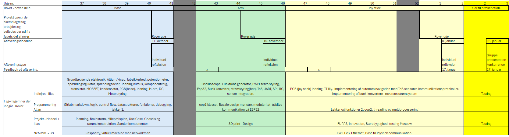

# Idea and Planning Phase

## Beskrivelse

Dette modul fokuserer på idé- og planlægningsfasen i et projekt. Der blev arbejdet med brainstorming, kravspecifikation, projektplanlægning og udarbejdelse af en milepælsplan for rover-projektet.

## Projektplan

*Figur 1. Projektplan og tidsplan for rover-projektet, der viser semesterets milepæle, arbejdsområder og sammenhængen mellem fagene.*

## Emner

- Brainstorming
- Kravspecifikation
- Projektplanlægning
- Milepælsplan
- Idé- og målsætningsfasen
- Analyse- og planlægningsfasen

## Hvad lærte jeg?

- At udvikle idéer gennem brainstorming.
- At udarbejde en kravspecifikation.
- At planlægge et projekt.
- At opstille milepæle.
- At strukturere et projekt fra idé til færdigt produkt.

## Kompetencer

- Brainstorming
- Kravspecifikation
- Projektplanlægning
- Milepælsplanlægning
- Analyse og planlægning
- Dokumentation
- Samarbejde

## Dokumentation

Denne mappe indeholder:

- Forelæsningsnoter
- Projektplan
- Billeder fra undervisningen
- Dokumentation af modulet
